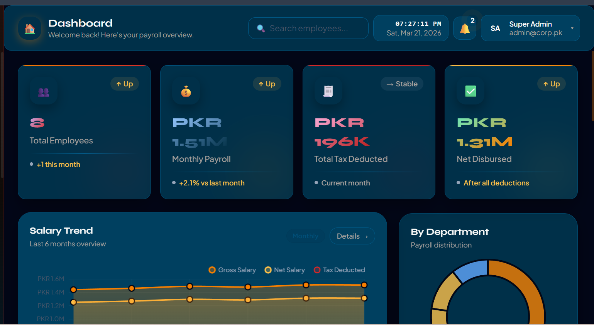
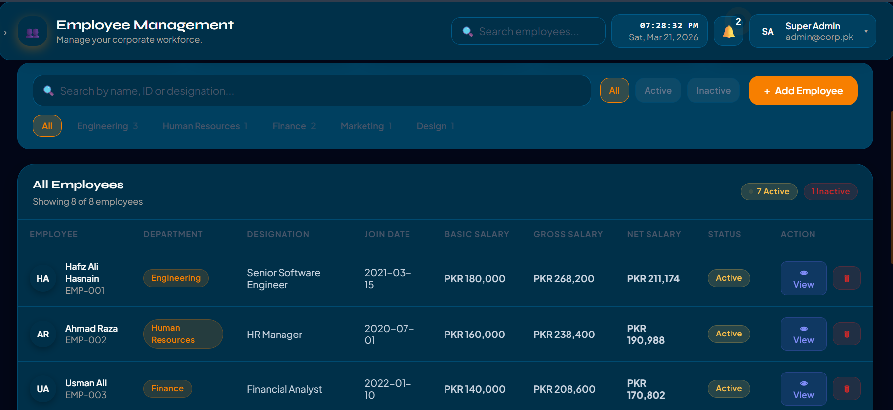
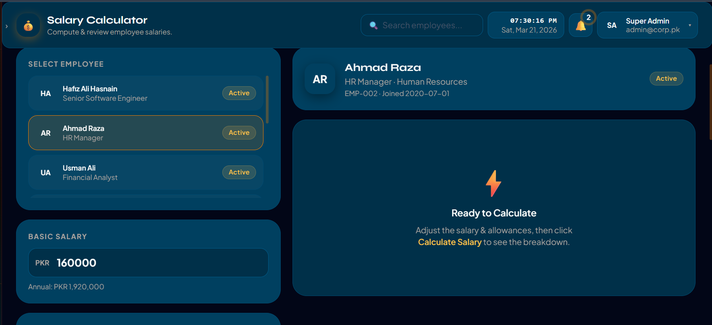
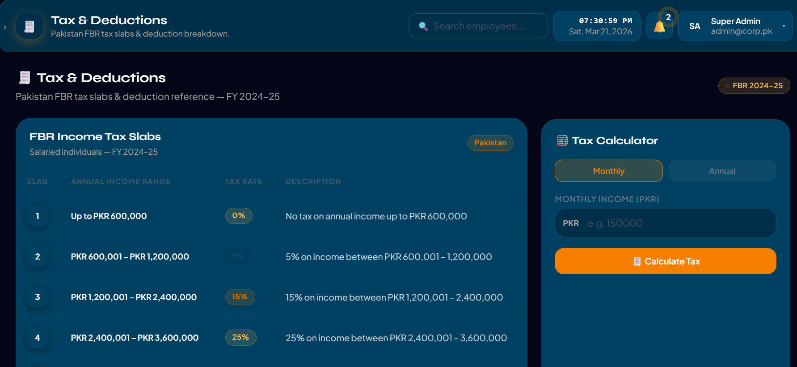
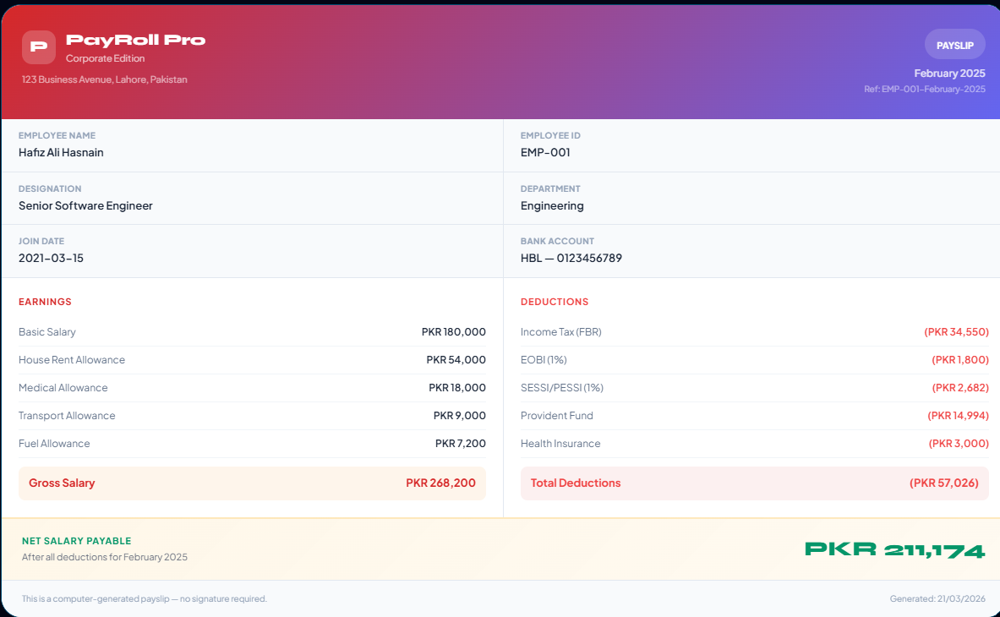

<div align="center">


# 💼 PayRoll Pro
### Corporate Payroll Management System


**A fully functional, beautifully designed Corporate Payroll Management System
built with React 18, Tailwind CSS & Chart.js**

[🚀 Live Demo](#) · [📸 Screenshots](#-screenshots) · [✨ Features](#-features) · [🛠 Installation](#-installation)

</div>

---

## ✨ Features

> 🎯 Everything a corporate HR & Finance team needs in one place

| Feature | Description |
|---|---|
| 🏠 **Dashboard** | Live charts, payroll history, employee snapshot |
| 👥 **Employee Management** | Add, view, search & filter employees |
| 💰 **Salary Calculator** | Full breakdown with allowances & deductions |
| 🧾 **Tax & Deductions** | Pakistan FBR 2024–25 tax slabs |
| 📄 **Payslip Generator** | Print-ready professional payslips |
| 🔔 **Notifications** | Real-time notification system |
| ⏰ **Live Clock** | Real-time date & time in header |
| 📊 **Charts** | Line chart & Doughnut chart via Chart.js |

---

## 📸 Screenshots

### 🏠 Dashboard


### 👥 Employee Management


### 💰 Salary Calculator


### 🧾 Tax & Deductions


### 📄 Payslip Generator


---

## 🛠 Tech Stack
```
Frontend     →  HTML5, CSS3, Tailwind CSS
UI Library   →  React 18 (via CDN)
JSX Parser   →  Babel Standalone
Charts       →  Chart.js 4.0
Fonts        →  Plus Jakarta Sans + Syne (Google Fonts)
Icons        →  Emoji-based icon system
```

---

## 📁 Project Structure
```
PayRoll System/
│
├── 📄 index.html              → App entry point
├── 🎨 style.css               → Custom styles & animations
│
└── src/
    ├── ⚛️  App.jsx             → Root app + routing + splash screen
    │
    ├── data/
    │   └── 📊 mockData.js     → All data, helpers & tax logic
    │
    ├── components/
    │   ├── 🃏 StatCard.jsx    → Reusable metric cards
    │   ├── 🔝 Header.jsx      → Top navigation bar
    │   └── 🗂️  Sidebar.jsx    → Left navigation sidebar
    │
    └── pages/
        ├── 🏠 Dashboard.jsx   → Overview & charts
        ├── 👥 Employees.jsx   → Employee management
        ├── 💰 Salary.jsx      → Salary calculator
        ├── 🧾 Taxes.jsx       → Tax & deductions
        └── 📄 Payslip.jsx     → Payslip generator
```

---

## 🚀 Installation & Setup

### Method 1 — Direct Open (Easiest)
```bash
# Just open index.html in your browser
# No installation needed!
```
> ✅ Works directly in Chrome or Firefox

### Method 2 — Clone from GitHub
```bash
# Step 1 — Clone the repository
git clone https://github.com/HafizJee786/payroll-management.git

# Step 2 — Navigate into folder
cd payroll-management

# Step 3 — Open in browser
# Just open index.html — done!
```

---

## 💡 How It Works
```
User opens index.html
        ↓
Splash screen loads (1.8 seconds)
        ↓
React mounts the App component
        ↓
Sidebar + Header render
        ↓
Dashboard page loads by default
        ↓
User clicks sidebar links to navigate
        ↓
Active page component renders with animation
```

---

## 🧮 Salary Formula
```
Gross Salary     =  Basic Salary + All Allowances
Income Tax       =  FBR Progressive Slab (Annual)
EOBI             =  1% of Basic Salary
SESSI / PESSI    =  1% of Gross Salary
Provident Fund   =  8.33% of Basic Salary
Health Insurance =  Fixed PKR 3,000

Net Salary  =  Gross Salary − Total Deductions
```

---

## 🧾 Pakistan FBR Tax Slabs 2024–25

| Annual Income | Tax Rate |
|---|---|
| Up to PKR 600,000 | 0% |
| PKR 600,001 – 1,200,000 | 5% |
| PKR 1,200,001 – 2,400,000 | 15% |
| PKR 2,400,001 – 3,600,000 | 25% |
| PKR 3,600,001 – 6,000,000 | 30% |
| Above PKR 6,000,000 | 35% |

---

## 👨‍💻 Author

<div align="center">

**Built with ❤️ for Corporate HR & Finance Teams**

[](https://github.com/HafizJee786)

[](https://www.linkedin.com/in/hafiz-ali-hasnain-5b8045230)

</div>

---

## 📜 License
```
MIT License — Free to use, modify and distribute
```

---

<div align="center">

**⭐ If you found this useful, please give it a star on GitHub! ⭐**

</div>
